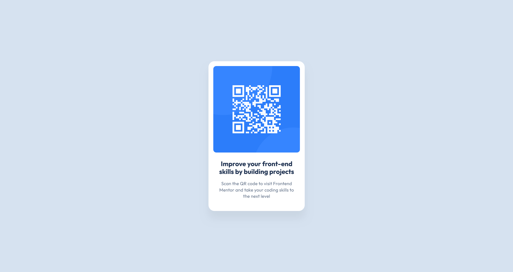

# Frontend Mentor - QR code component solution

This is a solution to the [QR code component challenge on Frontend Mentor](https://www.frontendmentor.io/challenges/qr-code-component-iux_sIO_H). Frontend Mentor challenges help you improve your coding skills by building realistic projects. 

## Table of contents

- [Frontend Mentor - QR code component solution](#frontend-mentor---qr-code-component-solution)
  - [Table of contents](#table-of-contents)
  - [Overview](#overview)
    - [Screenshot](#screenshot)
      - [Mobile](#mobile)
      - [Desktop](#desktop)
    - [Links](#links)
  - [My process](#my-process)
    - [Built with](#built-with)
  - [Author](#author)

## Overview

### Screenshot

#### Mobile

#### Desktop

### Links

- [Solution URL](https://www.frontendmentor.io/solutions/qr-code-component-with-sass-idxmnyaH36)
- [Live Site URL](https://manondupriez.github.io/QR-code-component/)

## My process

### Built with

- HTML
- CSS/Sass
- Flexbox

## Author

- Frontend Mentor - [@manondupriez](https://www.frontendmentor.io/profile/manondupriez)